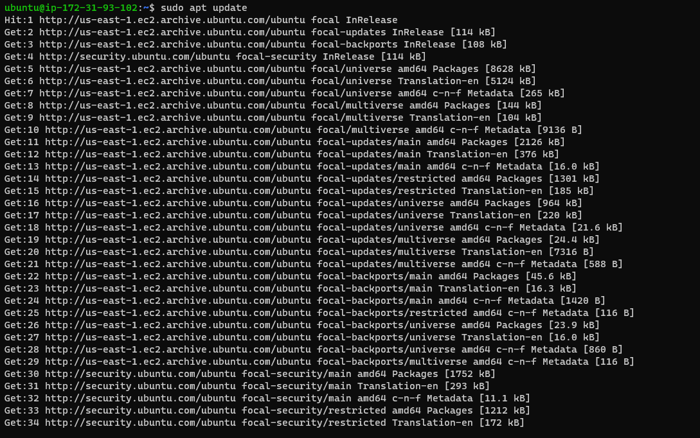
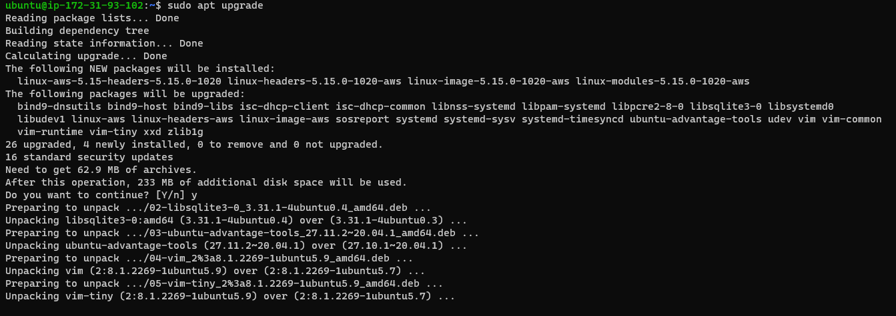
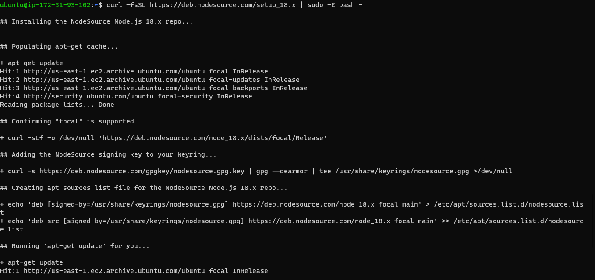
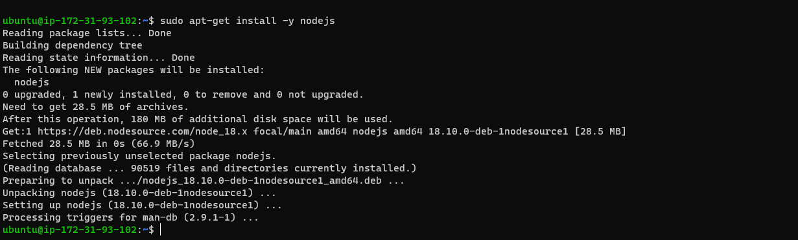
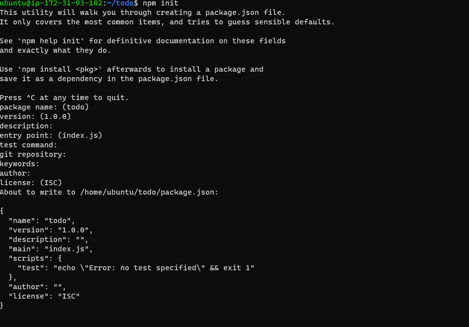
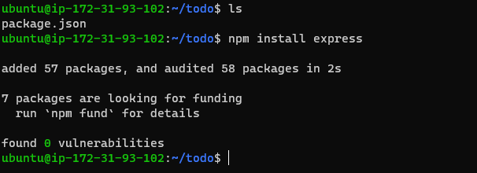
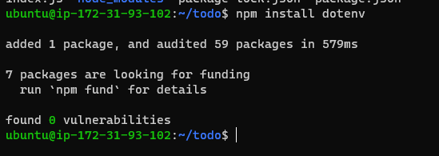
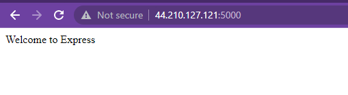
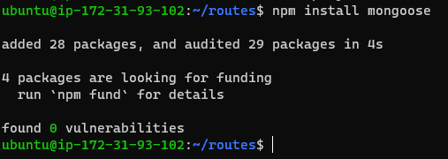
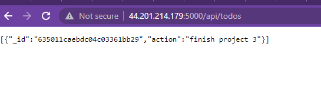

# Project 3 Documentation

`sudo apt update`

`sudo apt upgrade`

`curl -fsSL https://deb.nodesource.com/setup_18.x | sudo -E bash -`

`sudo apt-get install -y nodejs`

`npm init`

`npm install express`

`npm install dotenv`

*Opened port 5000 and launched it on my web browser. Got the welcome page*

`npm install mongoose`

