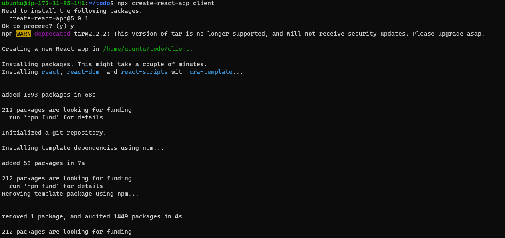
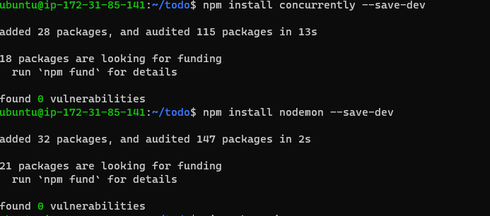
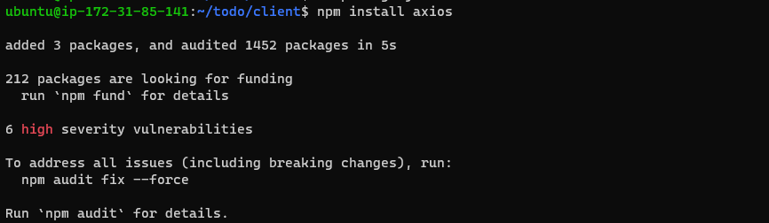
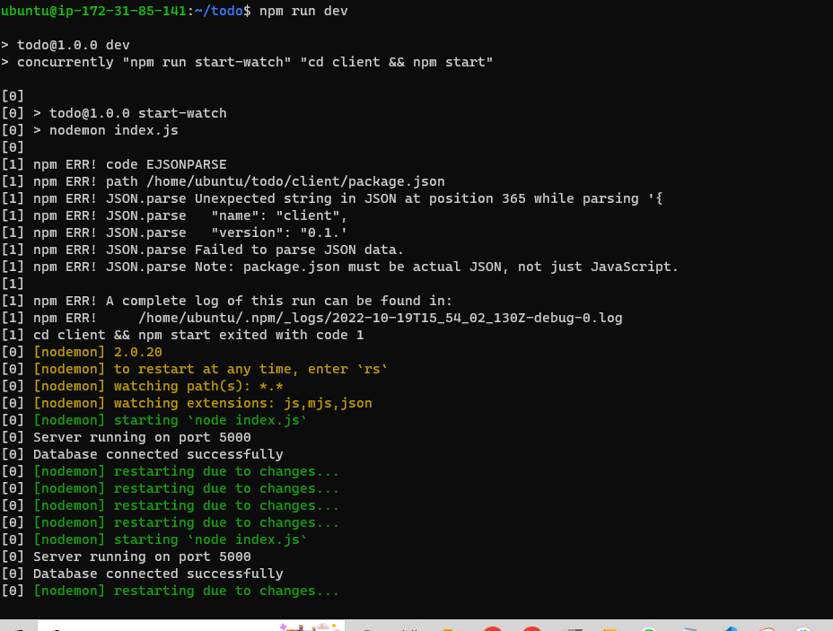
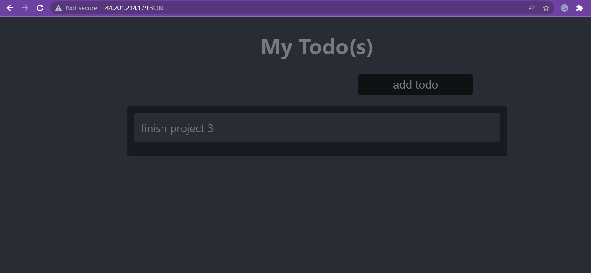

# Project 3 Documentation

`sudo apt update`

`sudo apt upgrade`

`curl -fsSL https://deb.nodesource.com/setup_18.x | sudo -E bash -`

`sudo apt-get install -y nodejs`

`npm init`

`npm install express`

`npm install dotenv`

*Opened port 5000 and launched it on my web browser. Got the welcome page*

`npm install mongoose`

## creating the frontend

`npx create-react-app client`

> Installing dependencies

`npm install concurrently --save-dev`

`npm install nodemon --save-dev`

> Install axios

`npm install axios`

>I needed to connect my server and ensure it works perfectly

`npm run dev`

*I replaced the .css files with the new codes provided then oppened port 3000 on my instance. My todo application was running*

